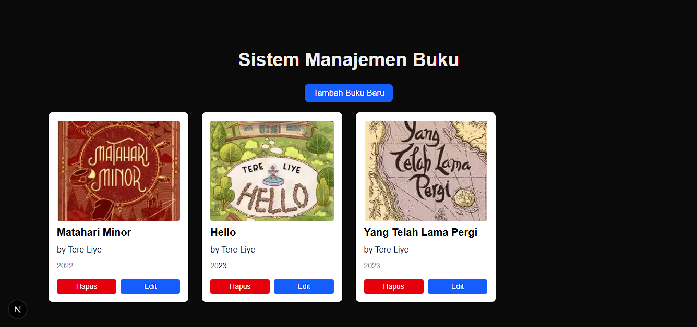

# Next.js Book Manager (CRUD Portofolio Project)

Sebuah aplikasi web full-stack Sistem Manajemen Buku (CRUD) yang dibangun dari awal menggunakan Next.js App Router, Prisma, dan TypeScript.

### 🚀 **[LIHAT LIVE DEMO DI SINI](https://nextjs-book-manager.vercel.app)** 🚀

 


---

## Deskripsi

Proyek ini adalah aplikasi CRUD lengkap yang memungkinkan pengguna untuk Menambah, Membaca, Mengedit, dan Menghapus (CRUD) data buku. Fitur ini mencakup upload gambar cover ke cloud storage (Vercel Blob) dan database relasional (Vercel Postgres).

## Tech Stack

- **Framework**: Next.js 14+ (App Router, Server Components & Client Components)
- **Bahasa**: TypeScript
- **Database**: Vercel Postgres (via Neon)
- **ORM**: Prisma
- **File Storage**: Vercel Blob
- **Styling**: Tailwind CSS
- **Deployment**: Vercel

---

## Fitur

- **Create (Tambah Buku)**: Form kustom dengan validasi sisi klien.
- **Read (Baca Buku)**: Data di-render di sisi server (SSR) menggunakan Server Components.
- **Update (Edit Buku)**: Halaman dinamis [id] dengan form yang sudah terisi data.
- **Delete (Hapus Buku)**: Aksi sisi klien dengan konfirmasi dan auto-refresh.
- **File Uploads**: Mengganti input URL teks menjadi upload file gambar asli, disimpan di Vercel Blob.

---

## Cara Menjalankan Lokal

1.  Clone repository ini:
    ```bash
    git clone https://github.com/muhtegaralfikri/nextjs-book-manager.git
    ```
2.  Install dependencies:
    ```bash
    cd nextjs-book-manager
    npm install
    ```
3.  Setup Vercel Postgres dan Vercel Blob di dashboard Vercel dan hubungkan ke proyek ini.

4.  Salin file `.env.example` menjadi `.env` dan isi *value*-nya:
    ```bash
    cp .env.example .env
    ```
5.  Jalankan migrasi database:
    ```bash
    npx prisma migrate dev
    ```
6.  Jalankan development server:
    ```bash
    npm run dev
    ```